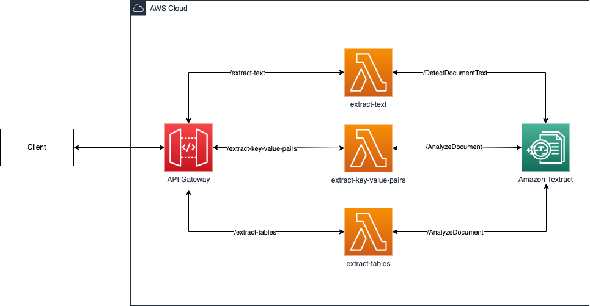

# Simple OCR API

The Simple Optical Character Recognition (OCR) API solution implements synchronous data extraction from single-page documents using Amazon API Gateway, AWS Lambda, and Amazon Textract.

## Table of contents

---

<!--ts-->

- [How it works](#how-it-works)
- [Project structure](#project-structure)
- [Getting started](#getting-started)
  - [Pre-requisites](#pre-requisites)
  - [Installation](#installation)
- [Usage](#usage)
  - [Invoking the API](#invoking-the-api)
  - [Examples](#examples)
- [API Documentation](#api-documentation)

<!--te-->

## How it works

---



> :warning: This artifact deploys a **public API** resource and should be **deleted** when not in use.

This solution consists of a REST API and three AWS Lambda functions. The API has three endpoints, each of which extracts a specific type of content from the input document. The endpoints are as follows: extract-text, which extracts plain text; extract-key-value-pairs, which extracts key-value pairs, and extract-tables, which extracts tables. When an endpoint is called, data are extracted from an input document by invoking an AWS Lambda function, which makes a call to an Amazon Textract API.

## Project structure

---

```
.-in
├── docs/               - Additional documentation for developing this project.
├── lambda/             - Code and custom libraries for AWS Lambda functions
├── infrastructure/     - Infrastructure as code written in AWS CDK
├── README.md           - This document
```

## Getting started

---

### Pre-requisites

The requirements for this project are as follows:

- [AWS CLI](https://docs.aws.amazon.com/cli/latest/userguide/cli-chap-welcome.html) >= v2: installed and configured
- [Python](https://www.python.org/) >= 3.8
- [AWS CDK](https://docs.aws.amazon.com/cdk/v2/guide/home.html#cpm)
- [Docker](https://docs.docker.com/get-docker/)
- [jq](https://stedolan.github.io/jq/download/)

### Installation

To work with AWS services locally, you will need to download and configure the AWS CLI tool. To download the AWS CLI, run:

```
$ python3 -m pip install awscli
```

To configure the AWS CLI, run the `aws configure` command. You can retrieve the AWS Access Key ID and AWS Secret Access Key by following the steps described here: [Getting IAM role credentials for CLI access](https://docs.aws.amazon.com/singlesignon/latest/userguide/howtogetcredentials.html).

```
$ aws configure
AWS Access Key ID: MYACCESSKEY
AWS Secret Access Key: MYSECRETKEY
Default region name []: [region-name]
Default output format [None]: json
```

## Set up

Deploy this stack as follows:

First, create a virtualenv on MacOS and Linux:

```
$ python3 -m venv .venv
```

After the init process completes and the virtualenv is created, you can use the following
step to activate your virtualenv.

```
$ source .venv/bin/activate
```

Once the virtualenv is activated, you can install this package. This will also install package dependencies.

```
$ pip install -e .
```

At this point you can navigate to the infrastructure folder and deploy stack.

> :warning: Ensure Docker is running before you deploy this stack!

```
$ cd infrastructure
$ cdk deploy
```

## Usage

---

### Invoking the API

To invoke the API, you will need the API invoke URLs for your use cases. You can access these API invoke URLs after the stack is deployed (as described in [Set up](#set-up)), by running the following command in your terminal:

```bash
aws cloudformation describe-stacks --stack-name OcrServiceStack| jq '.Stacks | .[] | .Outputs | reduce .[] as $i ({}; .[$i.OutputKey] = $i.OutputValue)'
```

Alternatively, you can view these outputs in the AWS Management Console by navigating to the CloudFormation service page, selecting the **OCRServiceStack** under Stacks, then selecting **Outputs**.

After you have obtained the API URLs, you can invoke the API by running the following curl command. Replace the placeholder values before running. Explanations of the placeholder values are specified in the table below.

```bash
$ (echo -n '{"documentStream": "'; base64 <FILE_PATH>; echo '"}') |
curl -H 'Content-Type: application/json' -XPOST <API_INVOKE_URL> -d @-
```

| Variable       | Description                                                       | Type   |
| -------------- | ----------------------------------------------------------------- | ------ |
| FILE_PATH      | The file path of the document from which text should be extracted | string |
| API_INVOKE_URL | The URL through which this API can be invoked                     | string |

The `API_INVOKE_URL` should contain the **base URL** (e.g `https://example123.execute-api.ap-southeast-2.amazonaws.com/prod/`) and the **endpoint** (e.g extract-text, extract-key-value-oars or extract-tables). For example, to invoke the extract-text endpoint, your `API_INVOKE_URL` may look like this: `https://example123.execute-api.ap-southeast-2.amazonaws.com/prod/extract-text`.

You would then use this API_INVOKE_URL when making the curl request to the extract-text endpoint as follows:

```bash
$ (echo -n '{"documentStream": "'; base64 invoice.pdf; echo '"}') |
curl -H 'Content-Type: application/json' -XPOST https://example123.execute-api.ap-southeast-2.amazonaws.com/prod/extract-text -d @-
```

Similarly, to invoke the extract-key-value pairs endpoint, you would use:

```bash
$ (echo -n '{"documentStream": "'; base64 invoice.pdf; echo '"}') |
curl -H 'Content-Type: application/json' -XPOST https://example123.execute-api.ap-southeast-2.amazonaws.com/prod/extract-key-value-pairs -d @-
```

And to invoke the extract-tables endpoint:

```bash
$ (echo -n '{"documentStream": "'; base64 invoice.pdf; echo '"}') |
curl -H 'Content-Type: application/json' -XPOST https://example123.execute-api.ap-southeast-2.amazonaws.com/prod/extract-tables -d @-
```

After deploying the stack, you can test the API by navigating to [./examples](./examples/), and running the command below. Replace `API_INVOKE_URL` with an URL for one of the API endpoints, as described in the [Usage section](#usage).

```bash
$ cd examples
$ (echo -n '{"documentStream": "'; base64 all-content.png; echo '"}') |
curl -H 'Content-Type: application/json' -XPOST <API_INVOKE_URL> -d @-
```

## API Documentation

To view the documentation for this solution's API, please see [docs/openapi.json](./docs/openapi.json).

## Security

See [CONTRIBUTING](CONTRIBUTING.md#security-issue-notifications) for more information.

## License

This library is licensed under the MIT-0 License. See the LICENSE file.
